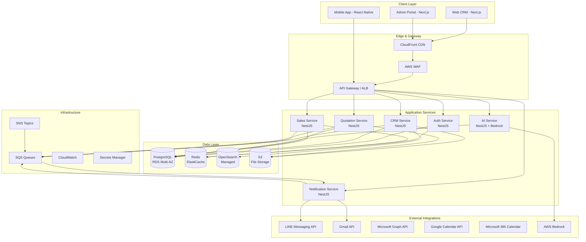
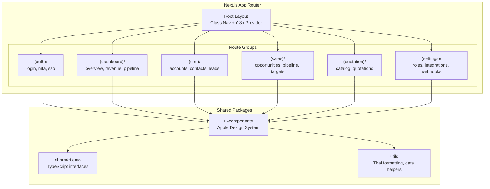

# Design Document — Thai SMB CRM Platform

## Overview

This document describes the technical design for a multi-tenant SaaS CRM platform purpose-built for Thai SMBs. The system serves retail, service, manufacturing, and distribution segments with deep Thailand localization, AI-powered sales assistance via AWS Bedrock, and an Apple-inspired design system.

The platform is structured as a monorepo with three frontend applications (`web-crm`, `admin-portal`, `mobile-app`), five backend microservices (`auth-service`, `crm-service`, `sales-service`, `quotation-service`, `notification-service`), and three shared packages (`ui-components`, `shared-types`, `utils`).

### Key Design Decisions

| Decision | Choice | Rationale |
|----------|--------|-----------|
| Architecture | Microservices via NestJS | Domain isolation for CRM, sales, quotation, auth, and notifications; independent scaling |
| Database | PostgreSQL with Row-Level Security (RLS) | Multi-tenant isolation without schema-per-tenant overhead; JSONB for flexible metadata |
| Frontend | Next.js (App Router) | SSR for SEO on public pages, RSC for dashboard performance, built-in i18n routing |
| Search | OpenSearch with ICU + Thai tokenizer | Full-text search with Thai language support and sub-500ms response times |
| AI | AWS Bedrock (Claude) | Managed inference, no GPU provisioning, Thai language support, pay-per-token |
| Cache | Redis | Session store, rate limiting, dashboard query caching, pub/sub for real-time events |
| Messaging | LINE Messaging API | Dominant messaging platform in Thailand (~54M monthly active users) |
| File Storage | S3 with tenant-prefixed keys | Cost-effective, durable, with presigned URLs for secure direct uploads |
| CI/CD | GitHub Actions → AWS CodePipeline | PR-level checks in GitHub, deployment orchestration via CodePipeline |

---

## Architecture

### High-Level System Architecture



### Multi-Tenant Isolation Strategy

Every request carries a `tenant_id` extracted from the JWT. PostgreSQL Row-Level Security (RLS) policies enforce that queries only return rows matching the authenticated tenant. This is the primary isolation boundary.

```
┌─────────────────────────────────────────────────┐
│  API Gateway                                     │
│  ┌─────────────────────────────────────────────┐ │
│  │ JWT → extract tenant_id → inject into ctx   │ │
│  └─────────────────────────────────────────────┘ │
│                      │                           │
│  ┌─────────────────────────────────────────────┐ │
│  │ NestJS TenantGuard middleware               │ │
│  │ SET app.current_tenant = :tenant_id         │ │
│  └─────────────────────────────────────────────┘ │
│                      │                           │
│  ┌─────────────────────────────────────────────┐ │
│  │ PostgreSQL RLS Policy                       │ │
│  │ WHERE tenant_id = current_setting(          │ │
│  │   'app.current_tenant')                     │ │
│  └─────────────────────────────────────────────┘ │
└─────────────────────────────────────────────────┘
```

Additional isolation layers:
- S3: Objects stored under `s3://{bucket}/{tenant_id}/...` prefix
- OpenSearch: Index-per-tenant pattern (`crm_{tenant_id}_accounts`, etc.)
- Redis: Key prefix `{tenant_id}:` for all cached data

### Service Communication

- Synchronous: REST over HTTP between services via internal ALB (service mesh optional for Phase 2)
- Asynchronous: SQS queues for event-driven workflows (lead assignment, notifications, webhook delivery)
- Event schema: All events follow a common envelope:

```typescript
interface DomainEvent {
  eventId: string;        // UUID v4
  eventType: string;      // e.g., "lead.created", "deal.stage_changed"
  tenantId: string;
  userId: string;
  timestamp: string;      // ISO 8601
  payload: Record<string, unknown>;
  version: number;        // Schema version
}
```

---

## Components and Interfaces

### 1. Auth Service (`services/auth-service`)

Handles authentication, session management, MFA, SSO, and RBAC.

**API Endpoints:**

| Method | Path | Description |
|--------|------|-------------|
| POST | `/auth/login` | Email/password login, returns JWT + refresh token |
| POST | `/auth/mfa/verify` | Verify TOTP/SMS code after initial login |
| POST | `/auth/sso/{provider}` | Initiate SSO flow (Google Workspace, Microsoft Entra ID) |
| POST | `/auth/sso/{provider}/callback` | SSO callback handler |
| POST | `/auth/logout` | Invalidate session, blacklist JWT |
| POST | `/auth/refresh` | Refresh access token |
| GET | `/auth/me` | Current user profile + permissions |
| POST | `/roles` | Create custom role (Admin only) |
| PUT | `/roles/:id` | Update role permissions |
| GET | `/roles` | List roles for tenant |
| POST | `/users` | Create user within tenant |
| PUT | `/users/:id/roles` | Assign roles to user |

**Key Interfaces:**

```typescript
interface AuthTokenPayload {
  sub: string;          // user_id
  tenantId: string;
  roles: string[];
  permissions: string[];
  iat: number;
  exp: number;
}

interface Permission {
  module: string;       // e.g., "leads", "opportunities", "quotations"
  actions: ('create' | 'read' | 'update' | 'delete')[];
}

interface Role {
  id: string;
  tenantId: string;
  name: string;
  isDefault: boolean;   // true for Admin, Sales Manager, Sales Rep, Viewer
  permissions: Permission[];
}
```

### 2. CRM Service (`services/crm-service`)

Manages Customer 360: accounts, contacts, notes, attachments, tags, activity timeline, and search.

**API Endpoints:**

| Method | Path | Description |
|--------|------|-------------|
| GET | `/accounts` | List accounts (paginated, filterable) |
| POST | `/accounts` | Create account |
| GET | `/accounts/:id` | Account detail with contacts, timeline |
| PUT | `/accounts/:id` | Update account |
| DELETE | `/accounts/:id` | Soft-delete account |
| GET | `/accounts/:id/contacts` | List contacts for account |
| POST | `/contacts` | Create contact |
| PUT | `/contacts/:id` | Update contact |
| POST | `/accounts/:id/notes` | Add note with optional attachments |
| GET | `/accounts/:id/timeline` | Activity timeline (paginated) |
| POST | `/tags` | Create tag |
| PUT | `/accounts/:id/tags` | Assign tags to account |
| GET | `/search` | Global search across entities |

**Key Interfaces:**

```typescript
interface Account {
  id: string;
  tenantId: string;
  companyName: string;
  industry: string;
  taxId?: string;
  phone?: string;
  email?: string;
  website?: string;
  address: ThaiAddress;
  tags: string[];
  createdBy: string;
  createdAt: Date;
  updatedAt: Date;
}

interface ThaiAddress {
  street?: string;
  subDistrict?: string;   // ตำบล/แขวง
  district?: string;       // อำเภอ/เขต
  province?: string;       // จังหวัด
  postalCode?: string;
}

interface Contact {
  id: string;
  tenantId: string;
  accountId: string;
  firstName: string;
  lastName: string;
  title?: string;
  phone?: string;
  email?: string;
  lineId?: string;
  tags: string[];
}

interface TimelineEntry {
  id: string;
  entityType: 'call' | 'email' | 'meeting' | 'note' | 'deal_change' | 'task';
  entityId: string;
  summary: string;
  userId: string;
  timestamp: Date;
  metadata: Record<string, unknown>;
}
```

### 3. Sales Service (`services/sales-service`)

Manages leads, opportunities, pipeline stages, and sales targets.

**API Endpoints:**

| Method | Path | Description |
|--------|------|-------------|
| POST | `/leads` | Create lead (manual or web capture) |
| POST | `/leads/import` | Bulk import from CSV/Excel |
| GET | `/leads` | List leads (Kanban or list view) |
| PUT | `/leads/:id` | Update lead |
| PUT | `/leads/:id/status` | Move lead to new status |
| POST | `/leads/:id/assign` | Assign lead to rep |
| POST | `/leads/bulk` | Bulk operations (assign, status, delete) |
| GET | `/leads/:id/duplicates` | Check for duplicate leads |
| POST | `/opportunities` | Create opportunity |
| GET | `/opportunities` | List opportunities (Kanban) |
| PUT | `/opportunities/:id` | Update opportunity |
| PUT | `/opportunities/:id/stage` | Move opportunity stage |
| PUT | `/opportunities/:id/close` | Close as Won/Lost with reason |
| GET | `/pipeline/summary` | Pipeline summary (value, count per stage) |
| GET | `/pipeline/stages` | Get configurable stages for tenant |
| PUT | `/pipeline/stages` | Update pipeline stages |
| POST | `/targets` | Set sales targets |
| GET | `/targets` | Get targets with progress |

**Key Interfaces:**

```typescript
interface Lead {
  id: string;
  tenantId: string;
  name: string;
  companyName?: string;
  email?: string;
  phone?: string;
  lineId?: string;
  source: string;
  status: string;           // Configurable per tenant
  assignedTo?: string;
  aiScore?: number;         // 0-100, updated daily by AI
  tags: string[];
  createdAt: Date;
  updatedAt: Date;
}

interface Opportunity {
  id: string;
  tenantId: string;
  dealName: string;
  accountId: string;
  contactId?: string;
  estimatedValue: number;   // Thai Baht
  stage: string;
  stageProbability: number; // 0-100%
  weightedValue: number;    // estimatedValue * stageProbability / 100
  expectedCloseDate: Date;
  closedReason?: string;
  closedNotes?: string;
  assignedTo: string;
  aiCloseProbability?: number; // 0-100%, predicted by AI
  createdAt: Date;
  updatedAt: Date;
}

interface PipelineStage {
  id: string;
  tenantId: string;
  name: string;
  order: number;
  probability: number;      // Default probability %
  color: string;
}

interface SalesTarget {
  id: string;
  tenantId: string;
  userId: string;
  period: 'monthly' | 'quarterly';
  year: number;
  month?: number;           // 1-12 for monthly
  quarter?: number;         // 1-4 for quarterly
  targetAmount: number;     // Thai Baht
  achievedAmount: number;
}
```

### 4. Quotation Service (`services/quotation-service`)

Manages product catalog, quotation creation, VAT/WHT calculation, PDF generation, and approval workflows.

**API Endpoints:**

| Method | Path | Description |
|--------|------|-------------|
| GET | `/products` | List product catalog |
| POST | `/products` | Add product to catalog |
| PUT | `/products/:id` | Update product |
| POST | `/quotations` | Create quotation |
| GET | `/quotations` | List quotations |
| GET | `/quotations/:id` | Quotation detail |
| PUT | `/quotations/:id` | Update quotation |
| POST | `/quotations/:id/finalize` | Generate PDF, assign number |
| POST | `/quotations/:id/send` | Send via email or LINE |
| PUT | `/quotations/:id/status` | Update status (Accepted, Rejected, Expired) |
| POST | `/quotations/:id/approve` | Manager approval for high-discount quotations |

**Key Interfaces:**

```typescript
interface Product {
  id: string;
  tenantId: string;
  name: string;
  sku: string;
  description?: string;
  unitPrice: number;        // Thai Baht
  unitOfMeasure: string;
  whtRate?: number;         // 0, 1, 2, 3, or 5 percent
  isActive: boolean;
}

interface Quotation {
  id: string;
  tenantId: string;
  quotationNumber: string;  // e.g., QT-2025-0001
  accountId: string;
  contactId?: string;
  opportunityId?: string;
  lineItems: QuotationLineItem[];
  subtotal: number;
  totalDiscount: number;
  vatAmount: number;        // 7% of (subtotal - discount)
  whtAmount: number;
  grandTotal: number;
  status: 'draft' | 'pending_approval' | 'sent' | 'accepted' | 'rejected' | 'expired';
  pdfUrl?: string;
  createdBy: string;
  createdAt: Date;
  updatedAt: Date;
  validUntil?: Date;
}

interface QuotationLineItem {
  productId: string;
  productName: string;
  sku: string;
  quantity: number;
  unitPrice: number;
  discount: number;         // Percentage or fixed amount
  discountType: 'percentage' | 'fixed';
  whtRate: number;
  lineTotal: number;
}
```

### 5. Notification Service (`services/notification-service`)

Handles LINE OA messaging, email delivery, in-app notifications, and webhook dispatch.

**API Endpoints:**

| Method | Path | Description |
|--------|------|-------------|
| POST | `/notifications/send` | Send notification (LINE, email, in-app) |
| GET | `/notifications` | List notifications for user |
| PUT | `/notifications/:id/read` | Mark notification as read |
| POST | `/webhooks` | Register webhook endpoint |
| GET | `/webhooks` | List webhook configurations |
| PUT | `/webhooks/:id` | Update webhook config |
| GET | `/webhooks/:id/logs` | Webhook delivery logs |
| POST | `/line/configure` | Configure LINE OA channel |
| POST | `/line/webhook` | LINE webhook receiver (incoming messages) |

**Key Interfaces:**

```typescript
interface Notification {
  id: string;
  tenantId: string;
  userId: string;
  channel: 'line' | 'email' | 'in_app';
  type: string;             // e.g., "lead_assigned", "task_overdue", "deal_stage_changed"
  title: string;
  body: string;
  metadata: Record<string, unknown>;
  status: 'pending' | 'sent' | 'delivered' | 'failed';
  retryCount: number;
  sentAt?: Date;
  createdAt: Date;
}

interface WebhookConfig {
  id: string;
  tenantId: string;
  url: string;
  secret: string;           // HMAC signing secret
  eventTypes: string[];      // e.g., ["lead.created", "opportunity.updated"]
  entityTypes: string[];     // e.g., ["lead", "opportunity"]
  isActive: boolean;
  createdAt: Date;
}

interface WebhookDelivery {
  id: string;
  webhookId: string;
  eventType: string;
  payload: Record<string, unknown>;
  responseStatus?: number;
  responseBody?: string;
  status: 'pending' | 'success' | 'failed';
  attempts: number;
  nextRetryAt?: Date;
  createdAt: Date;
}
```

### 6. AI Service (embedded in services or standalone)

Interfaces with AWS Bedrock for meeting summarization, lead scoring, close probability, chatbot, and NL search.

**API Endpoints:**

| Method | Path | Description |
|--------|------|-------------|
| POST | `/ai/summarize` | Summarize meeting notes |
| POST | `/ai/email-reply` | Generate email reply suggestion |
| GET | `/ai/lead-score/:leadId` | Get AI lead score |
| GET | `/ai/close-probability/:oppId` | Get AI close probability |
| POST | `/ai/chat` | Thai chatbot conversation |
| POST | `/ai/search` | Natural language search |
| GET | `/ai/next-action/:oppId` | Next-best-action suggestion |

**Key Interfaces:**

```typescript
interface AISummaryRequest {
  meetingNotes: string;
  language: 'th' | 'en';
}

interface AISummaryResponse {
  keyPoints: string[];
  actionItems: string[];
  nextSteps: string[];
  generatedAt: Date;
}

interface LeadScore {
  leadId: string;
  score: number;            // 0-100
  factors: ScoreFactor[];
  calculatedAt: Date;
}

interface ScoreFactor {
  name: string;
  weight: number;
  value: number;
  description: string;
}

interface ChatMessage {
  role: 'user' | 'assistant';
  content: string;
  timestamp: Date;
}

interface ChatSession {
  sessionId: string;
  tenantId: string;
  userId: string;
  messages: ChatMessage[];
  createdAt: Date;
  lastActiveAt: Date;
}
```

### 7. Frontend Architecture (`apps/web-crm`)



**State Management:** React Query (TanStack Query) for server state, Zustand for client-side UI state (sidebar, modals, command palette).

**i18n:** `next-intl` with Thai (th) as default locale, English (en) as secondary. Buddhist Era date formatting via custom `Intl.DateTimeFormat` wrapper in `packages/utils`.

**Design System Implementation (`packages/ui-components`):**
- Tailwind CSS with custom theme tokens matching the Apple-inspired design system
- SF Pro Display/Text loaded via `@font-face` with optical sizing
- Glass navigation component: `bg-black/80 backdrop-blur-[20px] backdrop-saturate-[180%]`
- Pill CTA component: `rounded-[980px]`
- Card component: light (`bg-[#f5f5f7]`) and dark (`bg-[#272729]`) variants
- All interactive elements use Apple Blue `#0071e3`
- Global search command palette (Cmd/Ctrl+K) using `cmdk` library

---

## Data Models

### Entity Relationship Diagram

```mermaid
erDiagram
    TENANT ||--o{ USER : has
    TENANT ||--o{ ROLE : defines
    TENANT ||--o{ ACCOUNT : owns
    TENANT ||--o{ LEAD : owns
    TENANT ||--o{ PIPELINE_STAGE : configures
    TENANT ||--o{ PRODUCT : catalogs
    TENANT ||--o{ WEBHOOK_CONFIG : registers

    USER ||--o{ USER_ROLE : assigned
    ROLE ||--o{ USER_ROLE : grants
    ROLE ||--o{ ROLE_PERMISSION : has

    ACCOUNT ||--o{ CONTACT : has
    ACCOUNT ||--o{ OPPORTUNITY : linked
    ACCOUNT ||--o{ NOTE : has
    ACCOUNT ||--o{ ACTIVITY : logged
    ACCOUNT ||--o{ ACCOUNT_TAG : tagged

    CONTACT ||--o{ ACTIVITY : logged
    CONTACT ||--o{ QUOTATION : addressed

    LEAD ||--o{ ACTIVITY : logged
    LEAD ||--o{ LEAD_SCORE : scored

    OPPORTUNITY ||--o{ ACTIVITY : logged
    OPPORTUNITY ||--o{ QUOTATION : generates
    OPPORTUNITY }o--|| PIPELINE_STAGE : at
    OPPORTUNITY ||--o{ OPPORTUNITY_HISTORY : tracks

    QUOTATION ||--o{ QUOTATION_LINE_ITEM : contains
    QUOTATION_LINE_ITEM }o--|| PRODUCT : references

    USER ||--o{ TASK : assigned
    TASK }o--o| ACCOUNT : linked
    TASK }o--o| CONTACT : linked
    TASK }o--o| OPPORTUNITY : linked

    USER ||--o{ NOTIFICATION : receives
    TENANT ||--o{ CONSENT_RECORD : stores
    TENANT ||--o{ AUDIT_LOG : records

    TENANT {
        uuid id PK
        string name
        string slug
        jsonb settings
        string line_channel_token
        string line_channel_secret
        boolean is_active
        timestamp created_at
    }

    USER {
        uuid id PK
        uuid tenant_id FK
        string email
        string password_hash
        string first_name
        string last_name
        string phone
        string line_id
        boolean mfa_enabled
        string mfa_secret
        string sso_provider
        string sso_subject
        string preferred_language
        string preferred_calendar
        boolean is_active
        timestamp last_login_at
        timestamp created_at
    }

    ROLE {
        uuid id PK
        uuid tenant_id FK
        string name
        boolean is_default
        timestamp created_at
    }

    ROLE_PERMISSION {
        uuid id PK
        uuid role_id FK
        string module
        string action
    }

    ACCOUNT {
        uuid id PK
        uuid tenant_id FK
        string company_name
        string industry
        string tax_id
        string phone
        string email
        string website
        string street
        string sub_district
        string district
        string province
        string postal_code
        jsonb custom_fields
        uuid created_by FK
        timestamp created_at
        timestamp updated_at
        timestamp deleted_at
    }

    CONTACT {
        uuid id PK
        uuid tenant_id FK
        uuid account_id FK
        string first_name
        string last_name
        string title
        string phone
        string email
        string line_id
        jsonb custom_fields
        timestamp created_at
        timestamp updated_at
    }

    LEAD {
        uuid id PK
        uuid tenant_id FK
        string name
        string company_name
        string email
        string phone
        string line_id
        string source
        string status
        uuid assigned_to FK
        integer ai_score
        jsonb metadata
        timestamp created_at
        timestamp updated_at
    }

    OPPORTUNITY {
        uuid id PK
        uuid tenant_id FK
        string deal_name
        uuid account_id FK
        uuid contact_id FK
        decimal estimated_value
        uuid stage_id FK
        decimal weighted_value
        date expected_close_date
        string closed_reason
        text closed_notes
        uuid assigned_to FK
        integer ai_close_probability
        timestamp created_at
        timestamp updated_at
    }

    PIPELINE_STAGE {
        uuid id PK
        uuid tenant_id FK
        string name
        integer sort_order
        integer probability
        string color
    }

    PRODUCT {
        uuid id PK
        uuid tenant_id FK
        string name
        string sku
        text description
        decimal unit_price
        string unit_of_measure
        decimal wht_rate
        boolean is_active
        timestamp created_at
    }

    QUOTATION {
        uuid id PK
        uuid tenant_id FK
        string quotation_number
        uuid account_id FK
        uuid contact_id FK
        uuid opportunity_id FK
        decimal subtotal
        decimal total_discount
        decimal vat_amount
        decimal wht_amount
        decimal grand_total
        string status
        string pdf_url
        date valid_until
        uuid created_by FK
        uuid approved_by FK
        timestamp created_at
        timestamp updated_at
    }

    QUOTATION_LINE_ITEM {
        uuid id PK
        uuid quotation_id FK
        uuid product_id FK
        string product_name
        string sku
        integer quantity
        decimal unit_price
        decimal discount
        string discount_type
        decimal wht_rate
        decimal line_total
    }

    TASK {
        uuid id PK
        uuid tenant_id FK
        string title
        text description
        date due_date
        string priority
        string status
        uuid assigned_to FK
        uuid account_id FK
        uuid contact_id FK
        uuid opportunity_id FK
        timestamp completed_at
        timestamp created_at
    }

    AUDIT_LOG {
        uuid id PK
        uuid tenant_id FK
        uuid user_id FK
        string entity_type
        uuid entity_id
        string action
        jsonb old_values
        jsonb new_values
        string ip_address
        timestamp created_at
    }

    CONSENT_RECORD {
        uuid id PK
        uuid tenant_id FK
        uuid contact_id FK
        string purpose
        string status
        date granted_at
        date expires_at
        date withdrawn_at
        timestamp created_at
    }

    NOTIFICATION {
        uuid id PK
        uuid tenant_id FK
        uuid user_id FK
        string channel
        string type
        string title
        text body
        jsonb metadata
        string status
        integer retry_count
        timestamp sent_at
        timestamp created_at
    }
```



### Key Database Design Decisions

1. **Row-Level Security**: Every table with tenant data includes `tenant_id` column. RLS policies enforce `WHERE tenant_id = current_setting('app.current_tenant')::uuid`.

2. **Soft Deletes**: Accounts, contacts, leads, and opportunities use `deleted_at` timestamp for soft deletion, supporting PDPA data retention requirements.

3. **Audit Log**: Immutable append-only table. Triggers on all CRM entity tables capture old/new values on INSERT, UPDATE, DELETE.

4. **Quotation Numbering**: Sequential per tenant using a `quotation_sequence` table with `SELECT ... FOR UPDATE` to prevent gaps under concurrency.

5. **Thai Address Fields**: Stored as separate columns (not JSONB) for indexing and search. OpenSearch maps these fields with Thai analyzer.

6. **PDPA Consent**: Separate `consent_record` table with immutable records. Consent withdrawal creates a new record (never updates existing).

### OpenSearch Index Mapping (per tenant)

```json
{
  "crm_{tenant_id}_global": {
    "mappings": {
      "properties": {
        "entity_type": { "type": "keyword" },
        "entity_id": { "type": "keyword" },
        "tenant_id": { "type": "keyword" },
        "title": {
          "type": "text",
          "analyzer": "thai_analyzer",
          "fields": { "keyword": { "type": "keyword" } }
        },
        "body": { "type": "text", "analyzer": "thai_analyzer" },
        "tags": { "type": "keyword" },
        "created_at": { "type": "date" },
        "updated_at": { "type": "date" }
      }
    },
    "settings": {
      "analysis": {
        "analyzer": {
          "thai_analyzer": {
            "type": "custom",
            "tokenizer": "icu_tokenizer",
            "filter": ["lowercase", "icu_folding"]
          }
        }
      }
    }
  }
}
```


---

## Correctness Properties

*A property is a characteristic or behavior that should hold true across all valid executions of a system — essentially, a formal statement about what the system should do. Properties serve as the bridge between human-readable specifications and machine-verifiable correctness guarantees.*

### Property 1: RBAC Enforcement

*For any* API endpoint and any user, the system SHALL grant access if and only if the user's assigned roles include the required permission (module + action) for that endpoint. All unauthorized attempts SHALL return HTTP 403.

**Validates: Requirements 2.1, 2.4**

### Property 2: Tenant Data Isolation

*For any* database query executed by any authenticated user, the result set SHALL contain only records where `tenant_id` matches the user's tenant. No query SHALL ever return data belonging to a different tenant.

**Validates: Requirements 3.1, 3.2, 3.3**

### Property 3: Activity Timeline Chronological Ordering

*For any* account's activity timeline containing N entries, the entries SHALL be ordered by timestamp in descending order (most recent first), such that for all consecutive pairs `timeline[i].timestamp >= timeline[i+1].timestamp`.

**Validates: Requirements 4.3**

### Property 4: Thai Address Formatting

*For any* valid Thai address with sub-district, district, province, and postal code components, the formatted output SHALL contain all non-empty components in the correct Thai address order (street, ตำบล/แขวง, อำเภอ/เขต, จังหวัด, postal code).

**Validates: Requirements 4.7, 12.5**

### Property 5: Lead Import Validation

*For any* CSV/Excel row, the import validator SHALL reject the row if and only if it is missing both phone and email AND missing name. The validator SHALL report errors per row with the specific missing fields identified.

**Validates: Requirements 5.2**

### Property 6: Round-Robin Lead Assignment

*For any* sequence of N leads assigned via round-robin to M sales reps, each rep SHALL receive either ⌊N/M⌋ or ⌈N/M⌉ leads, and the assignment order SHALL cycle through reps in consistent order.

**Validates: Requirements 5.3**

### Property 7: Lead Duplicate Detection

*For any* two leads within the same tenant, the duplicate detector SHALL flag them as potential duplicates if they share a matching email address, phone number, or company name (case-insensitive, whitespace-normalized).

**Validates: Requirements 5.6**

### Property 8: Pipeline Summary Aggregation

*For any* set of opportunities across pipeline stages, the pipeline summary SHALL report per-stage totals where: `stage.totalValue = sum(opportunity.estimatedValue)` for all opportunities in that stage, `stage.weightedValue = sum(opportunity.estimatedValue * stage.probability / 100)`, and `stage.dealCount = count(opportunities)` in that stage.

**Validates: Requirements 6.3, 6.5**

### Property 9: Task Sorting Correctness

*For any* set of tasks sorted by a given field (due_date, priority, or status), the resulting list SHALL be totally ordered according to that field's natural ordering (chronological for dates, High > Medium > Low for priority, defined enum order for status).

**Validates: Requirements 7.2**

### Property 10: Overdue Task Detection

*For any* task where `due_date < current_date` AND `status ∉ {Completed}`, the system SHALL mark the task as Overdue. Tasks that are completed or have future due dates SHALL NOT be marked Overdue.

**Validates: Requirements 7.3**

### Property 11: Quotation Financial Calculation

*For any* quotation with N line items, each having quantity, unit_price, discount, discount_type, and wht_rate, the system SHALL calculate:
- `line_total = (quantity × unit_price) - discount_amount` (where discount_amount depends on discount_type)
- `subtotal = sum(line_totals)`
- `vat_amount = (subtotal - total_discount) × 0.07`
- `wht_amount = sum(line_total × wht_rate / 100)` per applicable line
- `grand_total = subtotal - total_discount + vat_amount - wht_amount`

All calculations SHALL use decimal precision (2 decimal places, rounded half-up).

**Validates: Requirements 8.3, 12.4**

### Property 12: Quotation Number Sequentiality

*For any* tenant, quotation numbers SHALL be strictly sequential with no gaps. For quotation numbers with prefix P and sequence numbers S1, S2 created in order, `S2 = S1 + 1` SHALL hold, and the format SHALL match `{prefix}-{year}-{zero_padded_sequence}`.

**Validates: Requirements 8.5**

### Property 13: Quotation Status Transitions

*For any* quotation, status transitions SHALL follow the valid state machine: Draft → {Sent, pending_approval}, pending_approval → {Sent, Draft}, Sent → {Accepted, Rejected, Expired}. No other transitions SHALL be permitted.

**Validates: Requirements 8.7**

### Property 14: Discount Approval Routing

*For any* quotation where the total discount percentage exceeds the tenant's configured approval threshold, the system SHALL set the quotation status to `pending_approval`. Quotations at or below the threshold SHALL proceed directly to `sent` status.

**Validates: Requirements 8.8**

### Property 15: Exponential Backoff Retry

*For any* failed delivery (LINE message or webhook), the system SHALL retry with exponential backoff where the delay between attempt N and N+1 is `base_delay × 2^N`. The system SHALL stop retrying after the configured maximum attempts (3 for LINE, 5 for webhooks).

**Validates: Requirements 10.5, 17.5**

### Property 16: AI Score Bounds

*For any* lead score or opportunity close probability calculated by the AI service, the value SHALL be within the range [0, 100] inclusive. No score SHALL be negative or exceed 100.

**Validates: Requirements 11.3, 11.4**

### Property 17: Buddhist Era Date Conversion Round-Trip

*For any* valid Gregorian date, converting to Buddhist Era SHALL produce a year equal to `gregorian_year + 543`, and converting back SHALL produce the original Gregorian date. The day and month SHALL remain unchanged in both directions.

**Validates: Requirements 12.2**

### Property 18: Thai Baht Currency Formatting Round-Trip

*For any* non-negative number, formatting as Thai Baht SHALL produce a string matching the pattern `฿{digits_with_commas}.{two_decimals}`, and parsing the formatted string back SHALL yield the original number (within 0.01 tolerance for rounding).

**Validates: Requirements 12.3**

### Property 19: Audit Log Immutability

*For any* audit log entry or PDPA consent record, once created, the record SHALL never be modified or deleted. The count of records SHALL be monotonically non-decreasing, and the content of any previously created record SHALL remain identical across reads.

**Validates: Requirements 12.7, 15.4**

### Property 20: API Rate Limiting

*For any* tenant making API requests, the system SHALL allow up to 1000 requests per minute. The 1001st request within a one-minute window SHALL receive HTTP 429. After the window resets, requests SHALL be allowed again.

**Validates: Requirements 17.4**

### Property 21: Webhook Event Filtering

*For any* webhook configuration with specified entity types and event types, the system SHALL deliver only events matching both the configured entity type AND event type. Events not matching the filter SHALL NOT be delivered to that webhook endpoint.

**Validates: Requirements 17.6**

---

## Error Handling

### Error Response Format

All services return errors in a consistent JSON envelope:

```typescript
interface ErrorResponse {
  statusCode: number;
  error: string;           // HTTP status text
  message: string;         // Human-readable message (Thai or English based on locale)
  code: string;            // Machine-readable error code, e.g., "AUTH_INVALID_CREDENTIALS"
  details?: Record<string, unknown>; // Validation errors, field-level details
  traceId: string;         // Request trace ID for debugging
}
```

### Error Categories and Handling

| Category | HTTP Status | Handling Strategy |
|----------|-------------|-------------------|
| Validation errors | 400 | Return field-level errors, no retry |
| Authentication failure | 401 | Clear session, redirect to login |
| Authorization failure | 403 | Log security event, show permission denied |
| Resource not found | 404 | Show "not found" UI, no retry |
| Tenant mismatch | 403 | Log security event, reject silently |
| Rate limit exceeded | 429 | Return `Retry-After` header, client backs off |
| External service failure (LINE, Gmail) | 502 | Queue for retry with exponential backoff |
| Database connection error | 503 | Circuit breaker, fallback to cached data where possible |
| Unhandled exception | 500 | Log full stack trace, return generic error to client |

### Retry Policies

| Service | Max Retries | Backoff | Dead Letter |
|---------|-------------|---------|-------------|
| LINE Messaging API | 3 | Exponential (1s, 2s, 4s) | SQS DLQ → alert |
| Webhook delivery | 5 | Exponential (5s, 10s, 20s, 40s, 80s) | Log in webhook delivery table |
| Email sync (Gmail/Outlook) | 3 | Exponential (30s, 60s, 120s) | Notify user of persistent failure |
| Calendar sync | 3 | Exponential (60s, 120s, 240s) | Notify user |
| OpenSearch indexing | 3 | Fixed (5s) | Log and re-index on next change |
| AI/Bedrock inference | 2 | Fixed (2s) | Return graceful degradation message |

### Circuit Breaker Configuration

External service calls use a circuit breaker pattern:
- **Closed** (normal): Requests pass through
- **Open** (failure threshold reached): Requests fail fast for 30 seconds
- **Half-Open**: Allow one test request, close circuit if successful

Thresholds: 5 failures in 60 seconds opens the circuit.

### Account Lockout

- 5 consecutive failed login attempts → 15-minute lockout
- Lockout counter stored in Redis with TTL
- Successful login resets the counter
- Admin can manually unlock accounts

---

## Testing Strategy

### Dual Testing Approach

This project uses both unit tests and property-based tests for comprehensive coverage.

- **Unit tests** (Jest): Specific examples, edge cases, integration points, error conditions
- **Property-based tests** (fast-check): Universal properties across randomized inputs
- **Integration tests** (Jest + Supertest): API endpoint testing with real database
- **E2E tests** (Playwright): Critical user flows through the UI

### Property-Based Testing Configuration

- Library: **fast-check** (TypeScript)
- Minimum iterations: **100 per property**
- Each property test references its design document property
- Tag format: `Feature: thai-smb-crm, Property {number}: {property_text}`

### Test Organization

```
tests/
├── unit/
│   ├── auth/           # Auth service unit tests
│   ├── crm/            # CRM service unit tests
│   ├── sales/          # Sales service unit tests
│   ├── quotation/      # Quotation service unit tests
│   ├── notification/   # Notification service unit tests
│   └── utils/          # Shared utility unit tests
├── property/
│   ├── rbac.property.test.ts           # Property 1
│   ├── tenant-isolation.property.test.ts # Property 2
│   ├── timeline-ordering.property.test.ts # Property 3
│   ├── thai-address.property.test.ts    # Property 4
│   ├── lead-import.property.test.ts     # Property 5
│   ├── round-robin.property.test.ts     # Property 6
│   ├── duplicate-detection.property.test.ts # Property 7
│   ├── pipeline-summary.property.test.ts # Property 8
│   ├── task-sorting.property.test.ts    # Property 9
│   ├── overdue-detection.property.test.ts # Property 10
│   ├── quotation-calc.property.test.ts  # Property 11
│   ├── quotation-number.property.test.ts # Property 12
│   ├── quotation-status.property.test.ts # Property 13
│   ├── discount-approval.property.test.ts # Property 14
│   ├── retry-backoff.property.test.ts   # Property 15
│   ├── ai-score-bounds.property.test.ts # Property 16
│   ├── buddhist-era.property.test.ts    # Property 17
│   ├── thai-baht.property.test.ts       # Property 18
│   ├── audit-immutability.property.test.ts # Property 19
│   ├── rate-limiting.property.test.ts   # Property 20
│   └── webhook-filter.property.test.ts  # Property 21
├── integration/
│   ├── auth.integration.test.ts
│   ├── crm.integration.test.ts
│   ├── sales.integration.test.ts
│   ├── quotation.integration.test.ts
│   ├── line.integration.test.ts
│   ├── email-sync.integration.test.ts
│   ├── calendar-sync.integration.test.ts
│   ├── search.integration.test.ts
│   └── webhook.integration.test.ts
└── e2e/
    ├── login.e2e.test.ts
    ├── customer-360.e2e.test.ts
    ├── lead-pipeline.e2e.test.ts
    ├── quotation-flow.e2e.test.ts
    └── dashboard.e2e.test.ts
```

### Unit Test Focus Areas

- **Auth**: Credential validation, MFA flow, token generation/validation, password hashing
- **RBAC**: Permission checking logic, role hierarchy
- **CRM**: Account/contact CRUD, note creation, tag management
- **Sales**: Lead status transitions, opportunity stage changes, target calculations
- **Quotation**: Line item calculations, PDF template rendering, number generation
- **Notification**: Message formatting, channel routing, retry logic
- **Utils**: Thai date formatting, currency formatting, address formatting, Thai tokenization helpers

### Integration Test Focus Areas

- LINE Messaging API (mocked): Message send/receive, error handling, retry
- Gmail/Outlook sync (mocked): Email matching, bidirectional sync
- Calendar sync (mocked): Event creation, update, deletion
- OpenSearch: Thai text indexing, cross-entity search, relevance ranking
- S3: File upload with tenant prefix, presigned URL generation
- AWS Bedrock (mocked): Inference calls, session management

### E2E Test Critical Paths

1. Login → MFA → Dashboard
2. Create Account → Add Contact → Log Activity → View Timeline
3. Import Leads → Assign → Move through Pipeline → Close Won
4. Create Quotation → Calculate Totals → Generate PDF → Send via LINE
5. Global Search → Navigate to Result → View Detail
