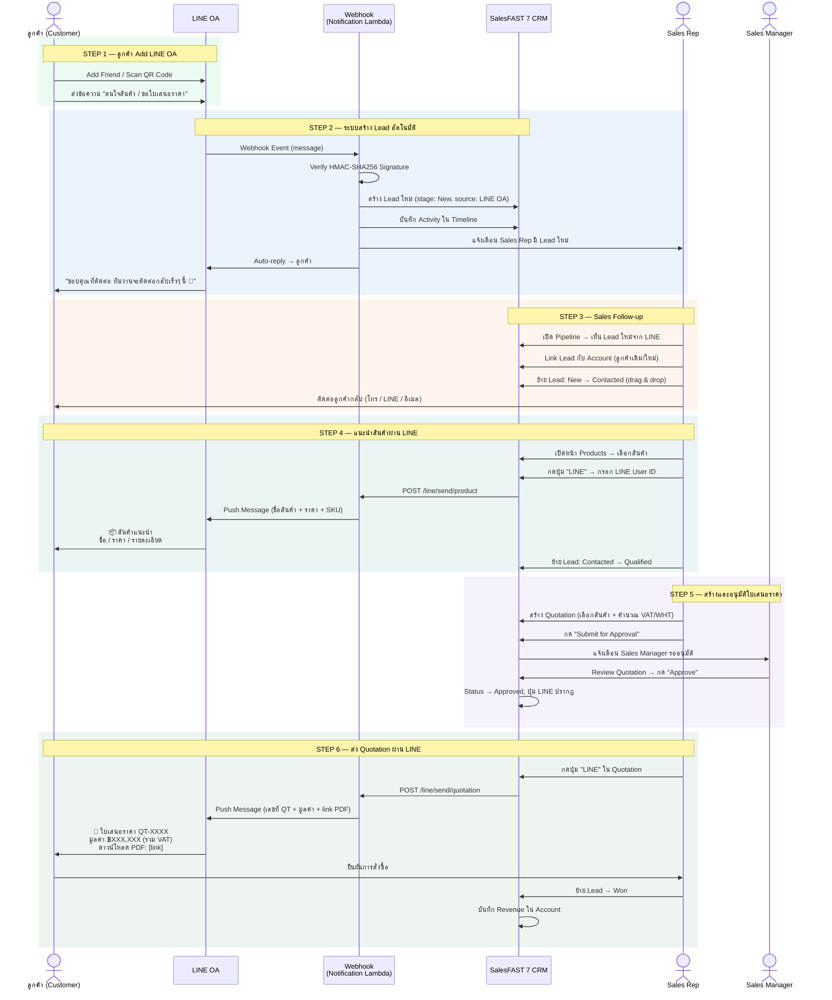
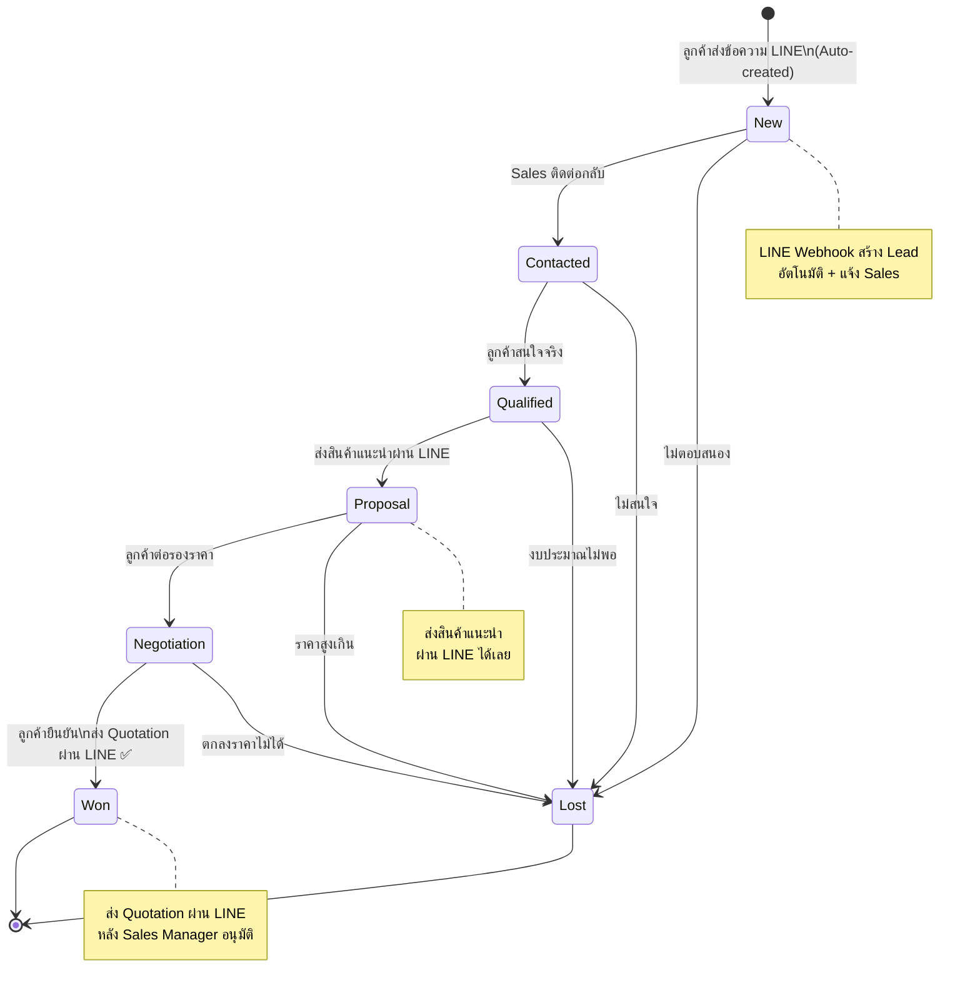
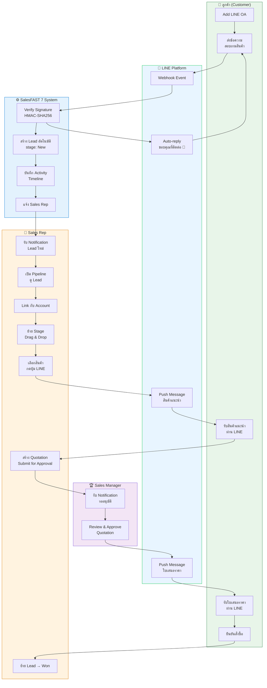

# SalesFAST 7

**CRM Platform for Thai SMB** | Bilingual (TH/EN) | Serverless on AWS (default: ap-southeast-1 Singapore)

SalesFAST 7 is a full-featured Customer Relationship Management platform designed for Thai small and medium businesses. It provides account management, sales pipeline with drag-and-drop Kanban, quotation workflow with approval, task management, document storage, and a BI dashboard — all with Thai localization including Buddhist calendar, Thai address format, and VAT/WHT calculation.

---

## Table of Contents

- [Features](#features)
- [Tech Stack](#tech-stack)
- [Project Structure](#project-structure)
- [Quick Start — Deploy on AWS CloudShell](#quick-start--deploy-on-aws-cloudshell)
- [AWS Cost Breakdown](#aws-cost-breakdown)
- [Capacity & Traffic](#capacity--traffic)
- [Architecture](#architecture)
- [Backend Services](#backend-services)
- [AI Agents](#ai-agents)
- [Knowledge Base](#knowledge-base)
- [LINE OA Integration](#line-oa-integration)
- [Database Schema](#database-schema)
- [Roles & Permissions](#roles--permissions)
- [Security](#security)
- [User Flow Diagram (Swimlane)](#user-flow-diagram-swimlane)
- [Data Flow Diagram](#data-flow-diagram)
- [i18n — Thai / English](#i18n--thai--english)
- [Default Credentials](#default-credentials)
- [Deploy Readiness Checklist](#deploy-readiness-checklist)

---

## Features

| Module | Description |
|--------|-------------|
| BI Dashboard | KPI cards, pipeline chart, revenue graph, mini Kanban, activity timeline, quick actions |
| Account Management | Customer 360 — company info, tax ID (13 digits), contacts, deals, quotations, tasks, documents, timeline |
| Document Storage | Upload, preview, download files per account (PDF, Word, Excel, images, ZIP, max 25MB) |
| Pipeline (Leads) | Kanban board with drag-and-drop — New > Contacted > Qualified > Proposal > Negotiation > Won/Lost. Total value per stage on column header |
| Quotation Workflow | Create, submit for approval, Sales Manager approves, then PDF download (A4). Company logo upload |
| Task & Call Logging | Task list with filters, log call form, linked to accounts with clickable links |
| Products / Catalog | Product catalog with SKU, pricing, WHT rate, create/edit form |
| Calendar | Monthly calendar with task creation, tasks shown as colored dots per day |
| Notifications | In-app notification center |
| Settings | User management + Roles & Permissions (CRUD matrix) |
| Admin Portal | Tenant management, audit logs, security, API keys, webhooks, PDPA, system health |
| i18n | Thai / English toggle, 150+ keys, stored in localStorage |
| Responsive | Desktop, tablet (768px), mobile (480px), small iPhone (380px) |

---

## Tech Stack

| Layer | Technology |
|-------|-----------|
| Frontend | HTML5, CSS3, Vanilla JavaScript — Salesforce Lightning design style |
| Backend | NestJS (TypeScript) on AWS Lambda Node.js 20.x — 1024MB per function |
| Database | PostgreSQL 16 on Amazon RDS db.t4g.medium + RDS Proxy |
| Auth | bcrypt cost-12 + JWT (15min access / 7d refresh), account lockout |
| CDN | Amazon CloudFront Pro Plan ($15/mo flat-rate) with OAC |
| Security | AWS WAF (included in Pro plan, 25 rules), DDoS protection, Helmet, RLS, TLS 1.2+ |
| Queue | Amazon SQS (event-driven notifications) + DLQ |
| Storage | Amazon S3 AES-256 encrypted, private |
| Backup | AWS Backup — daily snapshots, 7-day retention |
| Secrets | AWS Secrets Manager |
| IaC | AWS CloudFormation (~1,186 lines) |
| Monorepo | Turborepo + npm workspaces |
| Region | ap-southeast-1 (Singapore, default) — override with `--region` |

---

## Project Structure

```
CRM/
├── frontend/                    # Static HTML/CSS/JS frontend
│   ├── index.html               # Entry redirect
│   ├── landing.html             # Marketing landing page (TH/EN)
│   ├── login.html               # Login page (split layout)
│   ├── css/app.css              # Shared stylesheet (Salesforce Lightning theme)
│   ├── js/
│   │   ├── nav.js               # Shared navigation with dropdown menus
│   │   ├── data.js              # Mock data (accounts, leads, tasks, etc.)
│   │   ├── helpers.js           # Utilities: fmt(), esc(), auth helpers
│   │   └── i18n.js              # Thai/English translations (150+ keys)
│   ├── app/
│   │   ├── dashboard.html       # BI Dashboard
│   │   ├── accounts.html        # Account list + create form
│   │   ├── account-detail.html  # Customer 360 (7 tabs incl. Documents)
│   │   ├── leads.html           # Pipeline Kanban (drag-and-drop)
│   │   ├── quotations.html      # Quotation list + create
│   │   ├── quotation-detail.html# Approval workflow + PDF preview
│   │   ├── tasks.html           # Task list + call logging
│   │   ├── products.html        # Product catalog + create/edit
│   │   ├── calendar.html        # Monthly calendar + task creation
│   │   ├── notifications.html   # Notification center
│   │   └── settings.html        # Users + Roles & Permissions
│   └── admin/index.html         # Admin portal (12 sections)
│
├── services/                    # NestJS backend (5 microservices)
│   ├── auth-service/            # Auth, Users, Roles, API Keys, Security, Tenant
│   ├── crm-service/             # Accounts, Contacts, Tasks, Notes, Tags, Timeline, Audit, Consent
│   ├── sales-service/           # Leads, Opportunities, Pipeline, Targets, Reports
│   ├── quotation-service/       # Products, Quotations, PDF generation
│   └── notification-service/    # Notifications, Webhooks, LINE OA, Event consumer
│
├── database/
│   ├── schema.sql               # Complete PostgreSQL schema (30+ tables, RLS)
│   ├── seed.sql                 # Template seed — placeholders replaced by deploy.sh
│   └── README.md
│
├── infra/
│   ├── cloudformation.yaml      # Full AWS stack (~1,186 lines)
│   ├── deploy.sh                # One-command interactive deploy for CloudShell
│   ├── ARCHITECTURE.md          # Architecture & cost documentation
│   └── SECURITY-AUDIT.md        # Security audit report (18 issues — all fixed)
│
└── packages/
    ├── shared-types/            # TypeScript type definitions
    ├── ui-components/           # Shared React components (future use)
    └── utils/                   # Thai localization utilities
```

---

## Quick Start — Deploy on AWS CloudShell

### Prerequisites

- AWS Account with `ap-southeast-7` (Thailand) region enabled
- IAM user/role with CloudFormation, Lambda, RDS, S3, CloudFront, WAF, VPC permissions

### One-Command Deploy

Open [AWS CloudShell](https://console.aws.amazon.com/cloudshell/), then run:

```bash
git clone https://github.com/konsudtai/CRM.git && cd CRM/infra && bash deploy.sh \
  --email    admin@mycompany.com \
  --name     "Somchai Jaidee" \
  --password "MyPass@123" \
  --db-pass  auto \
  --tenant   "My Company Ltd"
```

> Default region: **ap-southeast-1 (Singapore)** — รองรับทุก service + Bedrock อยู่ใน region เดียวกัน
> ถ้าต้องการ deploy ที่ไทย: เพิ่ม `--region ap-southeast-7`

All flags are **required** (ยกเว้น --region):

| Flag | Example | Description |
|------|---------|-------------|
| `--email` | `admin@company.com` | Admin login email |
| `--name` | `"Somchai Jaidee"` | Admin full name |
| `--password` | `"Pass@123"` | Admin login password |
| `--db-pass` | `auto` or `"MyDbPass!"` | Database password (`auto` = generate random) |
| `--tenant` | `"My Company Ltd"` | Company / tenant name |

Optional flags:

| Flag | Default | Description |
|------|---------|-------------|
| `--region` | `ap-southeast-1` (Singapore, recommended) | CRM region |
| `--ai-region` | `ap-southeast-1` (Singapore) | Bedrock AI region |
| `--jwt` | Auto-generate | JWT signing key |
| `--stack` | `salesfast7-prod` | CloudFormation stack name |

The script deploys **everything automatically** in 10 steps:

```
Phase 1: CRM Stack
  [1/10]  Build pg Lambda Layer (node-postgres for DB init)
  [2/10]  Upload layer to S3
  [3/10]  Deploy CloudFormation (VPC, RDS, Lambda, API GW, S3, CloudFront)
  [4/10]  Get stack outputs (URLs, endpoints)
  [5/10]  Generate seed.sql with admin credentials (bcrypt hash)
  [6/10]  Initialize database via Lambda (schema + seed — automatic)
  [7/10]  Upload frontend to S3
  [8/10]  Invalidate CloudFront cache

Phase 2: AI Stack
  [9/10]  Deploy AI CloudFormation (S3 KB bucket, IAM roles)
  [10/10] Upload sample Knowledge Base documents
```

> Database init ทำอัตโนมัติผ่าน Lambda ที่อยู่ใน VPC เดียวกับ RDS
> ไม่ต้อง init เอง ไม่ต้องเปิด RDS Query Editor

### Region Compatibility

| Service | ap-southeast-7 (Thailand) | ap-southeast-1 (Singapore) |
|---------|:------------------------:|:--------------------------:|
| VPC, EC2, Lambda, S3, RDS | ✅ | ✅ |
| API Gateway, SQS, DynamoDB | ✅ | ✅ |
| CloudFront Pro Plan | ✅ Global (subscribe via Console) | ✅ Global |
| WAF | ✅ Included in Pro plan | ✅ Included in Pro plan |
| RDS Proxy | ⚠️ อาจยังไม่มี | ✅ |
| Amazon Bedrock | ❌ ไม่มี | ✅ ครบทุก model |

**ถ้า deploy ที่ ap-southeast-7 แล้ว RDS Proxy error:**
- RDS Proxy: ลบ `RDSProxy*` resources ออก, Lambda จะเชื่อม RDS ตรง

**CloudFront Pro Plan:** subscribe หลัง deploy ผ่าน CloudFront Console (ไม่ต้อง deploy WAF แยก)

**แนะนำสำหรับ production:** ใช้ `ap-southeast-1` (Singapore) เป็น CRM region เพราะรองรับทุก service + Bedrock อยู่ใน region เดียวกัน

### CloudFront Pro Plan — Setup หลัง Deploy

CloudFront Pro Plan เป็น flat-rate pricing $15/mo ที่รวมทุกอย่างไว้ในราคาเดียว ไม่มี overage charges:

```
สิ่งที่รวมอยู่ใน Pro Plan ($15/mo):
  - CloudFront CDN (750+ edge locations ทั่วโลก)
  - AWS WAF (25 rules: SQL injection, XSS, PHP, WordPress)
  - Always-on DDoS protection
  - Amazon Route 53 DNS
  - Amazon CloudWatch Logs ingestion
  - TLS certificate (free)
  - Serverless edge compute (CloudFront Functions)
  - 50GB S3 storage credits/mo
  - 10M requests/mo
  - 50TB data transfer/mo
  - Cache tag invalidation
  - Logging
```

**วิธี Subscribe (ทำครั้งเดียวหลัง deploy):**

```
1. เปิด AWS Console > CloudFront
2. เลือก Distribution ที่สร้างจาก deploy.sh
3. คลิก "Pricing plan" tab
4. เลือก "Pro" ($15/month)
5. กด "Subscribe"
6. เสร็จ — WAF + DDoS + DNS + Logs เปิดใช้งานอัตโนมัติ
```

**Usage Allowance:**
- 10M requests/mo + 50TB data transfer/mo (เพียงพอสำหรับ 50+ users)
- ถ้าเกิน: performance ลดลง (ใช้ edge locations น้อยลง) แต่ **ไม่มีค่าใช้จ่ายเพิ่ม**
- DDoS attacks + WAF-blocked requests **ไม่นับ** usage allowance
- AWS แจ้งเตือนที่ 50%, 80%, 100% ของ allowance

**เปรียบเทียบ Plan:**

| Plan | Price | Requests | Data Transfer | WAF Rules | S3 Credits |
|------|------:|--------:|-------------:|----------:|-----------:|
| Free | $0/mo | 1M | 100GB | 5 | 5GB |
| **Pro** | **$15/mo** | **10M** | **50TB** | **25** | **50GB** |
| Business | $200/mo | 125M | 50TB | 50 | 1TB |
| Premium | $1,000/mo | 500M | 50TB | 75 | 5TB |

> สำหรับ SalesFAST 7 (30-50 users, ~500K req/mo) → **Pro plan เพียงพอ**
> ถ้า users เกิน 300+ หรือ requests เกิน 10M/mo → upgrade เป็น Business plan

### What the Deploy Script Does

```
[1/10]  Build pg Lambda Layer (node-postgres)
[2/10]  Upload layer to S3
[3/10]  Deploy CloudFormation stack (~10-15 min first time)
[4/10]  Get stack outputs
[5/10]  Generate seed.sql with bcrypt-hashed admin password
[6/10]  Initialize database via Lambda (schema + seed — automatic)
[7/10]  Upload frontend to S3 with correct content types
[8/10]  Invalidate CloudFront cache
[9/10]  Deploy AI stack (S3 KB bucket + IAM roles)
[10/10] Upload sample Knowledge Base documents
```

> Database init ทำอัตโนมัติ ไม่ต้องทำเอง
> Script ใช้ Lambda function ที่อยู่ใน VPC เดียวกับ RDS เป็นตัว execute SQL

### Post-Deploy: Subscribe CloudFront Pro Plan ($15/mo)

> CloudFront Pro Plan ยังไม่มี CLI/API support — ต้องทำผ่าน Console (ทำครั้งเดียว ~2 นาที)

```
1. เปิด https://console.aws.amazon.com/cloudfront/v4/home
2. คลิก "Distributions"
3. เลือก Distribution ที่มี Comment "SalesFAST 7 prod"
4. คลิก "Edit" > เลือก Pricing plan "Pro" ($15/month)
5. กด "Save changes"
6. เสร็จ — WAF + DDoS + DNS + Logs + 50GB S3 เปิดใช้งานทันที
```

### Post-Deploy: ทดสอบระบบ

```bash
# 1. เปิด CloudFront URL (แสดงตอนจบ deploy)
# 2. Login ด้วย admin email + password ที่ตั้งตอน deploy
# 3. ระบบจะบังคับเปลี่ยนรหัสผ่านครั้งแรก
# 4. ตรวจสอบ: Dashboard, Accounts, Pipeline, Quotations, Settings
```

### Troubleshooting: Database Init Failed

ถ้า deploy script แจ้ง "DB INIT FAILED" (เกิดได้ถ้า Lambda ยังไม่พร้อม):

```
วิธี A: Run deploy.sh อีกครั้ง (จะ retry DB init)

วิธี B: RDS Query Editor (manual)
  1. Console > RDS > Query Editor
  2. Connect: sf7-prod / salesfast7 / (db-pass)
  3. Copy-paste database/schema.sql > Run
  4. Copy-paste /tmp/sf7-seed-generated.sql > Run
```

---

## AWS Cost Breakdown

### CRM Infrastructure (default: ap-southeast-1 Singapore)

| Service | Specification | Monthly Cost |
|---------|--------------|-------------:|
| RDS PostgreSQL | db.t4g.medium (2 vCPU, 4GB RAM), 100GB gp3, single-AZ, encrypted | $56.00 |
| VPC Endpoints | 3 interface endpoints (S3, SQS, Secrets Manager) — replaces NAT Gateway | $22.00 |
| RDS Proxy | Connection pooling — 2 vCPU x $0.015/hr x 730h | $15.00 |
| **CloudFront Pro Plan** | **Flat-rate $15/mo — CDN + WAF + DDoS + DNS + TLS + Logs + 50GB S3 credits (no overage)** | **$15.00** |
| AWS Backup | Daily snapshots, 7-day retention — RDS + S3 (09:00 TH) | $2.00 |
| CloudWatch | Logs + VPC Flow Logs (30-day retention) + 3 security alarms | $2.00 |
| Lambda | 5 functions x 1024MB, ~100K req/month | $2.00 |
| API Gateway | HTTP API, ~100K requests, throttled 50 req/s | $1.00 |
| S3 (Frontend + Files) | ~5GB, AES-256 encrypted, private (50GB covered by Pro plan credits) | $0.00 |
| Secrets Manager | 3 secrets (DB + JWT + LINE) | $1.50 |
| SQS | ~50K messages + DLQ | $0.50 |
| DynamoDB | 2 tables (chat history + AI state), on-demand, encrypted | $1.00 |
| **CRM Subtotal** | | **~$118/mo** |

> **CloudFront Pro Plan ($15/mo) includes:**
> 10M requests/mo, 50TB data transfer/mo, 25 WAF rules (SQL/XSS/PHP/WordPress),
> Always-on DDoS protection, Route 53 DNS, CloudWatch Logs ingestion, TLS certificate,
> Serverless edge compute, 50GB S3 storage credits, Cache tag invalidation, Logging.
> **No overage charges** — traffic spikes and DDoS attacks do not increase cost.
> Subscribe via: CloudFront Console > Distributions > select distribution > Pricing plan > Pro

### AI / Bedrock (ap-southeast-1 Singapore)

| Service | Specification | Monthly Cost |
|---------|--------------|-------------:|
| S3 (Knowledge Base) | เก็บเอกสาร KB ~1GB, AES-256 | $0.25 |
| IAM Roles | Bedrock Agent Role + KB Role (free) | $0.00 |
| **Bedrock — Chat Model** | **ขึ้นอยู่กับ model + ปริมาณใช้งาน (ดูตารางด้านล่าง)** | **$5–80** |
| Bedrock — Embedding | Amazon Titan Embed v2, ~10K chunks/mo | $0.10 |
| **AI Subtotal** | | **~$5–80/mo** |

### Bedrock Model Pricing (On-Demand, per 1K tokens)

| Model | Input | Output | Est. Cost/mo (30 users) |
|-------|------:|-------:|------------------------:|
| Amazon Nova Lite 2.0 | $0.00006 | $0.00024 | **~$2–5** |
| Claude 3 Haiku | $0.00025 | $0.00125 | **~$5–15** |
| DeepSeek R1 | $0.00135 | $0.00540 | **~$8–20** |
| Mistral Small | $0.001 | $0.003 | **~$5–15** |
| Qwen 2.5 72B | $0.0008 | $0.0008 | **~$5–12** |
| Llama 3.1 8B | $0.00022 | $0.00022 | **~$2–5** |
| Claude 3.5 Sonnet | $0.003 | $0.015 | **~$20–50** |
| Claude Sonnet 4 | $0.003 | $0.015 | **~$20–50** |
| Claude Opus 4 | $0.015 | $0.075 | **~$50–150** |
| Cohere Command R+ | $0.003 | $0.015 | **~$15–40** |

> ประมาณการ: 30 users, ~500 conversations/mo, avg 2K input + 1K output tokens per conversation
> แนะนำเริ่มต้น: **Claude 3 Haiku** หรือ **Amazon Nova Lite 2.0** (ถูกที่สุด, เร็วที่สุด)

### รวมทั้งหมด

| Category | Monthly Cost |
|----------|-------------:|
| CRM Infrastructure | ~$118 |
| AI (Nova Lite / Haiku) | ~$5-15 |
| **Total (แนะนำ)** | **~$123-133/mo** |
| AI (Sonnet 4 / Opus 4) | ~$20-150 |
| **Total (Premium model)** | **~$138-268/mo** |

### Cost Optimizations Applied

- CloudFront Pro Plan $15/mo flat-rate — รวม CDN + WAF + DDoS + DNS + TLS + Logs + 50GB S3 credits, no overage
- No NAT Gateway — saves $32/month, uses VPC Endpoints instead
- No Cognito — bcrypt + JWT in PostgreSQL saves ~$0-5/month
- Serverless Lambda instead of EC2/ECS — no idle compute cost
- Single-AZ RDS — acceptable for SMB, saves ~$56/month vs Multi-AZ
- HTTP API Gateway — 70% cheaper than REST API
- S3 storage covered by Pro plan — 50GB/mo credits included (frontend ~5GB ใช้ฟรี)
- Bedrock On-Demand — จ่ายตามใช้จริง ไม่มี minimum, ไม่มี commitment
- DynamoDB On-Demand — ไม่ต้อง provision capacity, จ่ายตาม request
- AI stack แยก region — deploy Bedrock ที่ Singapore (ใกล้ไทย, มีทุก model)

---

## Capacity & Traffic

> CRM is designed for sales teams — not high-traffic consumer apps. Typical usage is 10-50 concurrent users during business hours.

### Current Spec Limits

| Component | Spec | Effective Limit |
|-----------|------|----------------|
| Lambda | 1024MB, 5 functions | 1,000 concurrent executions (AWS default) |
| RDS Proxy | Connection pool | ~150 pooled connections to RDS |
| RDS | db.t4g.medium, 4GB RAM | ~170 max DB connections |
| API Gateway | HTTP API | 10,000 req/s (regional) |
| CloudFront Pro | WAF 25 rules | SQL/XSS/PHP/WordPress + DDoS protection |
| CloudFront Pro | Requests | 10M requests/mo (no overage) |
| CloudFront Pro | Data Transfer | 50TB/mo (no overage) |

### Recommended User Capacity at ~$130/mo

| Usage Pattern | Concurrent Users | Req/month | Status |
|--------------|-----------------|-----------|--------|
| Light (5-10 sales users) | 10-20 | ~100K | Comfortable |
| Normal (20-30 sales users) | 30-50 | ~500K | Good |
| Peak (50 sales users) | 50-80 | ~1M | Optimal sweet spot |
| Heavy (100+ users) | 100-150 | ~3M | RDS starts to strain |

**Sweet spot: 30-50 active sales users** — ใช้งานได้สบายมากที่ ~$130/mo (CRM + AI)

### Cost Scaling Scenarios

| Users | Req/month | Changes Needed | Est. Cost |
|-------|-----------|---------------|-----------|
| 5-50 | 100K-1M | ไม่ต้องเปลี่ยน | **~$130/mo** |
| 50-150 | 1M-3M | Lambda req cost เพิ่ม | **~$140-155/mo** |
| 150-300 | 3M-8M | Upgrade RDS → db.t4g.large | **~$215-245/mo** |
| 300-500 | 8M-20M | RDS db.t4g.xlarge + Read Replica | **~$365-415/mo** |
| 500+ | 20M+ | Multi-AZ RDS + ElastiCache + CF Business plan | **$500+/mo** |

### When to Upgrade

- **RDS → db.t4g.large** เมื่อ concurrent users เกิน 150 (~$130/mo เพิ่ม)
- **Read Replica** เมื่อ query หนัก หรือ report ใช้ CPU มาก (~$56/mo เพิ่ม)
- **Lambda Provisioned Concurrency** เมื่อต้องการลด cold start (~$5-10/mo เพิ่ม)
- **Multi-AZ RDS** เมื่อต้องการ 99.95% uptime SLA (~$56/mo เพิ่ม)

---

## Architecture

```
                         ┌─────────────────────────────┐
                         │   CloudFront (Flat Rate PRO) │
                         │   + WAF v2 (SQLi/XSS/Bots)  │
                         │   + Security Headers (HSTS)  │
                         └──────────┬──────────┬────────┘
                                    │          │
                          Static    │          │  API Routes
                          Files     │          │
                         ┌──────────▼──┐  ┌───▼──────────────┐
                         │  S3 Bucket  │  │  API Gateway HTTP │
                         │  (OAC,AES)  │  │  50 req/s throttle│
                         └─────────────┘  └───┬──────────────┘
                                              │
              ┌──────────┬──────────┬─────────┴──┬──────────┐
              │          │          │             │          │
         ┌────▼───┐ ┌────▼───┐ ┌───▼────┐ ┌─────▼──┐ ┌─────▼──┐
         │  Auth  │ │  CRM   │ │ Sales  │ │ Quota. │ │ Notif. │
         │ Lambda │ │ Lambda │ │ Lambda │ │ Lambda │ │ Lambda │
         │ 1024MB │ │ 1024MB │ │ 1024MB │ │ 1024MB │ │ 1024MB │
         └────┬───┘ └────┬───┘ └───┬────┘ └─────┬──┘ └──┬─────┘
              │          │         │             │       │
              └──────────┴────┬────┴─────────────┘   ┌──▼──┐
                              │                       │ SQS │
                    ┌─────────▼──────────┐            └─────┘
                    │    RDS Proxy       │
                    │  (Connection Pool) │
                    └─────────┬──────────┘
                              │
                    ┌─────────▼──────────┐
                    │  RDS PostgreSQL 16  │
                    │  db.t4g.medium      │
                    │  100GB gp3 (private)│
                    │  RLS on all tables  │
                    └────────────────────┘

         All Lambdas → Secrets Manager (VPC endpoint)
         CRM/Quotation → S3 Files (VPC endpoint)
         Auth/CRM/Sales/Quotation → SQS (VPC endpoint)
         AWS Backup → Daily snapshot RDS + S3 (7-day retention)
```

---

## Backend Services

### auth-service (Port 3001)
| Module | Description |
|--------|-------------|
| auth | Login, MFA verify, SSO, refresh token, logout, token blacklist |
| users | List, create, update, deactivate, activate, reset password |
| roles | Role CRUD, permission matrix |
| api-keys | Create, list, revoke API keys (SHA-256 hashed) |
| security-settings | IP allowlist, MFA settings |
| tenant | Tenant management |

Guards: `GatewayAuthGuard`, `TenantGuard`, `PermissionGuard`, `RateLimiterGuard` (Redis sliding window), `IpAllowlistGuard`, `ApiKeyGuard`

### crm-service (Port 3002)
| Module | Description |
|--------|-------------|
| accounts | Customer 360 — CRUD, search, shareholders, documents |
| contacts | Contact management per account |
| notes | Notes + file attachments |
| tasks | Task CRUD, assignment, status tracking |
| activities | Activity timeline per entity |
| tags | Account tagging |
| timeline | Unified timeline view |
| search | Full-text search |
| audit | Audit log recording |
| consent | PDPA consent records |
| email | Email sync (Gmail/Outlook) |
| calendar | Calendar sync (Google/Microsoft) |
| event-bus | SQS event publishing |

### sales-service (Port 3003)
| Module | Description |
|--------|-------------|
| leads | Lead CRUD, status tracking, source tracking |
| opportunities | Deal management, stage history |
| pipeline | Pipeline stage configuration |
| targets | Sales targets per user/period |
| reports | Sales reports and analytics |
| event-bus | SQS event publishing |

### quotation-service (Port 3004)
| Module | Description |
|--------|-------------|
| products | Product catalog CRUD, SKU, WHT rates |
| quotations | Quotation CRUD, line items, VAT 7%, WHT, approval workflow, PDF |
| event-bus | SQS event publishing |

### notification-service (Port 3005)
| Module | Description |
|--------|-------------|
| notifications | In-app, email, LINE notifications |
| webhooks | Webhook config + delivery tracking |
| line | LINE OA integration |
| event-consumer | SQS event consumer (triggered by Lambda event source mapping) |

---

## AI Agents

SalesFAST 7 มี AI Agent 3 ตัว ทำงานร่วมกัน:

| # | Agent | ที่ไหน | หน้าที่ |
|---|-------|--------|---------|
| 1 | **Admin AI Agent** | LINE OA (ตอบลูกค้าอัตโนมัติ) | ตอบคำถามสินค้า/ราคา, ถามข้อมูลสร้าง Lead, จำ context follow-up |
| 2 | **น้องขายไว** | ทุกหน้า CRM (floating widget มุมขวาล่าง) | Personal Assistant — assign lead, approve QT, แจ้ง task, สรุปลูกค้า |
| 3 | **น้องวิ — Analytics** | Dashboard (floating widget มุมขวาล่าง) | วิเคราะห์ — forecast, churn risk, win rate, เปรียบเทียบทีม |

```
ลูกค้า (LINE OA)              ทีมขาย (CRM)                Dashboard
       │                           │                           │
       ▼                           ▼                           ▼
┌──────────────┐          ┌──────────────┐          ┌──────────────┐
│ Admin AI     │          │ น้องขายไว│          │ น้องวิ       │
│ Agent        │─────────>│              │          │ Analytics    │
│              │ แจ้ง Lead│ • Assign Lead│          │              │
│ • ตอบ LINE   │          │ • Approve QT │          │ • Forecast   │
│ • สร้าง Lead │          │ • แจ้ง Sales │          │ • Churn Risk │
│ • ตอบสินค้า  │          │ • สรุปลูกค้า │          │ • Win Rate   │
│ • จำ context │          │ • เขียน Email│          │ • Team Perf  │
└──────────────┘          └──────────────┘          └──────────────┘
```

### น้องขายไว — แยกตาม Role

**Sales Manager เห็น:**
- Lead รอ assign + QT รออนุมัติ
- พิมพ์ "assign ให้ อรุณ" → assign lead + แจ้ง Sales Rep อัตโนมัติ
- พิมพ์ "approve" → อนุมัติ QT + แจ้งผู้สร้าง + เปิด PDF download
- สรุปทีม, งานเกินกำหนดของทีม

**Sales Rep เห็น:**
- Lead ที่ assign ให้ + งานวันนี้ + เกินกำหนด
- สร้าง QT, ดูสถานะ QT, เขียน email, สรุปลูกค้า

---

## Knowledge Base

Knowledge Base คือข้อมูลที่ AI Agent ใช้ตอบลูกค้าและวิเคราะห์ เก็บใน S3 → Bedrock Knowledge Base

### โครงสร้างไฟล์

```
S3: sf7-prod-knowledge-base/
│
├── products/
│     └── product-catalog.json     ← sync จาก DB อัตโนมัติ (ทุกวัน)
│
├── company/
│     ├── company-profile.md       ← Admin อัปโหลดใน Settings
│     └── sales-playbook.md        ← วิธีตอบลูกค้า, objection handling
│
└── faq/
      └── faq.md                   ← คำถามที่ถามบ่อย
```

### วิธีเพิ่ม/อัปเดต Knowledge Base

#### วิธีที่ 1: ผ่าน Settings (แนะนำ)

```
1. ไปที่ Settings > Add-ons > AI Agent
2. หา section "Knowledge Base"
3. กด "Upload Document"
4. เลือกไฟล์ (.md, .txt, .json, .pdf)
5. ระบบจะ upload ไป S3 และ re-index อัตโนมัติ
```

#### วิธีที่ 2: ผ่าน AWS Console (สำหรับ Admin)

```bash
# Upload ไฟล์ไป S3
aws s3 cp company-profile.md s3://sf7-prod-knowledge-base/company/

# Upload product catalog
aws s3 cp product-catalog.json s3://sf7-prod-knowledge-base/products/

# Upload FAQ
aws s3 cp faq.md s3://sf7-prod-knowledge-base/faq/
```

#### วิธีที่ 3: Auto-sync Product Catalog

Product catalog จะ sync จาก database อัตโนมัติทุกวัน ไม่ต้องทำเอง

### ตัวอย่างไฟล์ Knowledge Base

**company-profile.md:**
```markdown
# ข้อมูลบริษัท
ชื่อ: บริษัท XYZ จำกัด
ที่อยู่: 123 ถนนสุขุมวิท กรุงเทพฯ 10110
โทร: 02-xxx-xxxx
เวลาทำการ: จันทร์-ศุกร์ 9:00-18:00
อีเมล: info@xyz.co.th

# บริการหลัก
- ระบบ ERP สำหรับ SME
- ระบบ CRM
- ที่ปรึกษาด้าน IT
```

**faq.md:**
```markdown
# คำถามที่ถามบ่อย

Q: ติดตั้งนานแค่ไหน?
A: 2-4 สัปดาห์ ขึ้นอยู่กับขนาดธุรกิจ

Q: มีบริการหลังการขายไหม?
A: มีครับ รวม support 1 ปี ในราคาแพ็กเกจ

Q: รองรับกี่ users?
A: ไม่จำกัดจำนวน users

Q: ชำระเงินอย่างไร?
A: โอนเงิน, เช็ค, หรือบัตรเครดิต
```

**product-catalog.json** (auto-generated จาก DB):
```json
[
  {
    "name": "ระบบ ERP มาตรฐาน",
    "sku": "ERP-STD-001",
    "price": 250000,
    "unit": "ชุด",
    "description": "ระบบ ERP ครบวงจร สต็อก+บัญชี+รายงาน",
    "features": ["จัดการสต็อก", "ระบบบัญชี", "รายงาน real-time"]
  }
]
```

### AI ใช้ Knowledge Base อย่างไร

```
ลูกค้าถาม: "ระบบ ERP ราคาเท่าไหร่"
        │
        ▼
Admin AI Agent ค้นหา Knowledge Base
        │
        ├── พบ: product-catalog.json → ERP ฿250,000
        ├── พบ: faq.md → ติดตั้ง 2-4 สัปดาห์
        └── พบ: company-profile.md → เวลาทำการ จ-ศ
        │
        ▼
ตอบลูกค้า: "ระบบ ERP ราคา ฿250,000 ครับ
            รวมติดตั้ง+อบรม+support 1 ปี
            ติดตั้งประมาณ 2-4 สัปดาห์ครับ"
```

---

## LINE OA Integration

LINE OA Integration is an **optional add-on** available in Settings > Add-ons. It connects SalesFAST 7 with LINE Official Account to automatically receive leads, send product recommendations, and deliver quotations through LINE — the primary communication channel for Thai SMB customers.

### Prerequisites

1. **LINE Official Account** — สมัครที่ [LINE for Business](https://lineforbusiness.com/th/)
2. **LINE Messaging API** — เปิดใช้งานใน [LINE Developers Console](https://developers.line.biz)
3. **Channel Access Token** + **Channel Secret** จาก LINE Developers

### Setup Guide — ทำครั้งเดียว (10 นาที)

#### Step 1: สร้าง LINE Official Account (ถ้ายังไม่มี)

```
1. ไปที่ https://entry.line.biz/
2. Login ด้วย LINE account ส่วนตัว
3. กด "สร้างบัญชี LINE Official Account"
4. กรอกข้อมูล:
   - ชื่อบัญชี: ชื่อบริษัทของคุณ
   - ประเภทธุรกิจ: เลือกตามจริง
   - อีเมล: อีเมลบริษัท
5. กด "สร้างบัญชี"
6. ได้ LINE OA พร้อมใช้งาน
```

#### Step 2: เปิด Messaging API

```
1. ไปที่ https://developers.line.biz/console/
2. กด "Create a new provider" (ถ้ายังไม่มี)
   - ตั้งชื่อ: ชื่อบริษัท
3. กด "Create a Messaging API channel"
   - เลือก Provider ที่สร้าง
   - Channel name: ชื่อ LINE OA
   - Channel description: อธิบายสั้นๆ
   - Category: เลือกตามจริง
   - Subcategory: เลือกตามจริง
4. กด "Create"
```

#### Step 3: Copy Channel Access Token + Secret

```
ใน LINE Developers Console:

1. เลือก Channel ที่สร้าง
2. ไปที่ tab "Messaging API"
3. เลื่อนลงหา "Channel access token"
   → กด "Issue" ถ้ายังไม่มี
   → Copy token เก็บไว้

4. ไปที่ tab "Basic settings"
5. หา "Channel secret"
   → Copy secret เก็บไว้

⚠️ เก็บ token และ secret เป็นความลับ อย่าแชร์ให้ใคร
```

#### Step 4: ตั้งค่าใน SalesFAST 7

```
1. เปิด SalesFAST 7 CRM
2. ไปที่ Settings > Add-ons
3. หา "LINE OA Integration"
4. กรอก:
   - Channel Access Token: (วางที่ copy มา)
   - Channel Secret: (วางที่ copy มา)
   - Channel Name: @ชื่อ LINE OA ของคุณ
5. กด "Save Configuration"
6. กด "Test Connection" → ต้องขึ้น "Connected ✅"
7. Copy "Webhook URL" ที่แสดง
```

#### Step 5: ตั้ง Webhook URL ใน LINE Developers

```
1. กลับไปที่ LINE Developers Console
2. เลือก Channel > tab "Messaging API"
3. หา "Webhook settings"
4. กด "Edit"
5. วาง Webhook URL ที่ copy จาก SalesFAST 7:
   https://your-cloudfront.net/line/webhook
6. กด "Update"
7. กด "Verify" → ต้องขึ้น "Success"
8. เปิด "Use webhook" → ON

⚠️ สำคัญ: ปิด "Auto-reply messages" ใน LINE OA Manager
   เพราะ AI Agent จะตอบแทน
   ไปที่: LINE OA Manager > Settings > Response settings
   → Auto-reply: OFF
   → Webhook: ON
```

#### Step 6: ทดสอบ

```
1. เปิด LINE บนมือถือ
2. Add Friend LINE OA ของคุณ (ถ้ายังไม่ได้ add)
3. ส่งข้อความ: "สนใจสินค้า"
4. AI Agent ควรตอบกลับภายใน 3-5 วินาที
5. ตรวจสอบใน CRM:
   - Lead ใหม่ปรากฏใน Pipeline
   - น้องขายไว แจ้ง Sales Manager
```

#### สรุป Checklist

```
□ สร้าง LINE Official Account
□ เปิด Messaging API ใน LINE Developers
□ Copy Channel Access Token
□ Copy Channel Secret
□ กรอกใน SalesFAST 7 Settings > Add-ons
□ Copy Webhook URL จาก SalesFAST 7
□ วาง Webhook URL ใน LINE Developers
□ Verify webhook → Success
□ เปิด Use webhook → ON
□ ปิด Auto-reply ใน LINE OA Manager
□ ทดสอบส่งข้อความ → AI ตอบกลับ ✅
```

---

### Full Customer Journey — LINE to Quotation



---

### State Diagram — Lead Pipeline จาก LINE



---

### Flow แบบ Swimlane



---

### API Endpoints

| Method | Endpoint | Description |
|--------|----------|-------------|
| POST | `/line/configure` | บันทึก Channel Token + Secret |
| GET | `/line/status` | ตรวจสอบสถานะการเชื่อมต่อ |
| POST | `/line/webhook` | รับ events จาก LINE Platform |
| POST | `/line/send/product` | ส่งสินค้าแนะนำผ่าน LINE |
| POST | `/line/send/quotation` | ส่งใบเสนอราคาผ่าน LINE |
| POST | `/line/broadcast` | Broadcast ข้อความหลายคน |

### Feature Toggles (Settings > Add-ons)

| Feature | Default | Description |
|---------|---------|-------------|
| Auto-create Lead | ON | สร้าง Lead อัตโนมัติเมื่อมีข้อความใหม่ |
| แจ้งเตือน Sales Rep | ON | Push notification เมื่อมีข้อความ |
| บันทึก Timeline | ON | บันทึก LINE messages ใน Account |
| Auto-reply | OFF | ตอบอัตโนมัตินอกเวลาทำการ |

---

## Database Schema

**30+ tables** organized in 8 sections:

| Section | Tables | Description |
|---------|--------|-------------|
| Tenants & Auth | `tenants`, `users`, `roles`, `role_permissions`, `user_roles`, `api_keys`, `ip_allowlist_entries` | Multi-tenant auth, bcrypt+JWT, force_password_change, lockout |
| Accounts | `accounts` (45+ columns), `contacts`, `account_shareholders`, `account_documents`, `tags`, `account_tags` | Customer 360 with Thai business data |
| Activities | `activities`, `notes`, `attachments`, `tasks` | Timeline, notes, file attachments |
| Sales | `pipeline_stages`, `leads`, `lead_scores`, `opportunities`, `opportunity_histories`, `sales_targets` | Pipeline management |
| Quotations | `products`, `quotations`, `quotation_line_items`, `quotation_sequences` | Quotation with VAT 7% / WHT |
| Notifications | `notifications`, `webhook_configs`, `webhook_deliveries` | Multi-channel notifications |
| Compliance | `audit_logs`, `consent_records` | PDPA compliance, audit trail |
| Integrations | `email_syncs`, `calendar_syncs` | Email & calendar sync |

**Key Design Decisions:**
- `accounts` has 45+ columns for Thai business specifics (tax ID 13 digits, branch code, registered capital, Thai address)
- Row Level Security (RLS) on all tables — tenant isolation via `set_config('app.current_tenant', $1, true)` (parameterized, SQL injection safe)
- Soft delete (`deleted_at`) on accounts
- `force_password_change: true` on all new users
- `failed_login_count` + `locked_until` for brute-force protection

---

## Roles & Permissions

| Permission | Admin | Sales Manager | Sales Rep | Viewer |
|-----------|:-----:|:------------:|:---------:|:------:|
| Accounts — CRUD | C R U D | C R U | C R | R |
| Contacts — CRUD | C R U D | C R U | C R | R |
| Leads — CRUD | C R U D | C R U D | C R U | R |
| Opportunities — CRUD | C R U D | C R U D | C R U | R |
| Quotations — CRUD | C R U D | C R U | C R | R |
| Tasks — CRUD | C R U D | C R U D | C R U | R |
| Reports | R | R | R | R |
| Users — CRUD | C R U D | — | — | — |
| Settings | R U | — | — | — |

Additional roles available: Accounting, Support, Marketing.

---

## Security

All 18 security issues from the audit have been fixed.

| Layer | Protection |
|-------|-----------|
| Edge | WAF v2 (SQLi, XSS, rate limit 1000/5min per IP, bad bots), TLS 1.2+, HSTS, CSP, X-Frame-Options |
| API Gateway | Throttling (50 req/s, 100 burst), CORS restricted to CloudFront domain only |
| Application | Helmet on all 5 services, JWT 15min expiry, bcrypt cost-12, lockout after 5 attempts/15min |
| Database | RLS on all tables, parameterized `set_config()`, SSL enforced (`rds.force_ssl=1`), encrypted at rest |
| Network | VPC private subnets, restricted Lambda egress (VPC CIDR only), VPC Flow Logs |
| Storage | S3 AES-256 encryption, BlockPublicAccess, OAC-only access, CORS restricted to CloudFront |
| Secrets | AWS Secrets Manager, no hardcoded fallbacks (fail-fast if env var missing) |
| Monitoring | CloudWatch alarms: auth errors (>50/5min), 4xx rate (>500/5min), RDS connections (>80) |
| Backup | AWS Backup daily snapshots, 7-day retention, encrypted vault |

---

## User Flow Diagram (Swimlane)

```
+============+==============+================+===============+==============+
|   Admin    | Sales Manager|   Sales Rep    |   System      |   Customer   |
+============+==============+================+===============+==============+
|            |              |                |               |              |
| Create     |              |                |               |              |
| Users &    |              |                |               |              |
| Assign     |              |                |               |              |
| Roles      |              |                |               |              |
|   |        |              |                |               |              |
|   +--------+-> Login      |                |               |              |
|            |   |          |                |               |              |
|            |   v          |                |               |              |
|            | View         | Login          |               |              |
|            | Dashboard    |   |            |               |              |
|            |              |   v            |               |              |
|            |              | Add Account ---+-> Validate    |              |
|            |              | (Customer)     |   Tax ID      |              |
|            |              |   |            |   Store in DB |              |
|            |              |   v            |               |              |
|            |              | Upload Docs    |               |              |
|            |              | to Account     |               |              |
|            |              |   |            |               |              |
|            |              |   v            |               |              |
|            |              | Create Lead ---+-> Pipeline    |              |
|            |              | (from Account) |   Kanban      |              |
|            |              |   |            |               |              |
|            |              |   v            |               |              |
|            |              | Drag Lead      |               |              |
|            |              | through stages |               |              |
|            |              | (drag & drop)  |               |              |
|            |              |   |            |               |              |
|            |              |   v            |               |              |
|            |              | Create         |               |              |
|            |              | Quotation -----|-> Calculate   |              |
|            |              | (from Account) |   VAT 7%      |              |
|            |              |   |            |   WHT         |              |
|            |              |   v            |               |              |
|            |              | Submit for     |               |              |
|            |              | Approval       |               |              |
|            |   +----------+---+            |               |              |
|            |   v                           |               |              |
|            | Review &                      |               |              |
|            | Approve QT                    |               |              |
|            |   |                           |               |              |
|            |   v                           |               |              |
|            | Download PDF --+-> Generate   |               |              |
|            |                |   A4 PDF     |               |              |
|            |                |   |          |               |              |
|            |                |   v          |               |              |
|            |                | Send to -----+-------------->| Receive QT   |
|            |                | Customer     |               |              |
+============+==============+================+===============+==============+
```

---

## Data Flow Diagram

```
+------------------+    HTTPS/TLS 1.2+    +----------------------+
|   Web Browser    | ──────────────────>  │  CloudFront + WAF v2 │
|   (Frontend)     | <──────────────────  │  (Edge, Thailand)    │
+------------------+   HTML/CSS/JS/JSON   +──────┬───────┬───────+
                                                 │       │
                                       Static    │       │ API
                                       Files     │       │ Routes
                                        ┌────────▼──┐ ┌──▼──────────────┐
                                        │ S3 Bucket │ │  API Gateway    │
                                        │ (OAC)     │ │  HTTP API       │
                                        └───────────┘ └──────┬──────────┘
                                                             │
                         ┌──────────┬──────────┬────────────┴──┬──────────┐
                    ┌────▼───┐ ┌────▼───┐ ┌───▼────┐ ┌────────▼─┐ ┌─────▼──┐
                    │  Auth  │ │  CRM   │ │ Sales  │ │ Quotation│ │ Notif. │
                    │ 1024MB │ │ 1024MB │ │ 1024MB │ │  1024MB  │ │ 1024MB │
                    └────┬───┘ └────┬───┘ └───┬────┘ └────┬─────┘ └──┬─────┘
                         │          │         │            │          │
                         └──────────┴────┬────┴────────────┘     ┌───▼───┐
                                         │                        │  SQS  │
                               ┌─────────▼──────────┐            └───────┘
                               │    RDS Proxy        │
                               │  (Connection Pool)  │
                               └─────────┬───────────┘
                                         │
                               ┌─────────▼──────────┐
                               │  RDS PostgreSQL 16  │
                               │  30+ tables, RLS    │
                               └─────────────────────┘

                    All Lambdas ──> Secrets Manager (VPC endpoint)
                    CRM/Quotation ─> S3 Files (VPC endpoint)
                    AWS Backup ───> Daily snapshot (7-day retention)
```

---

## i18n — Thai / English

- 150+ translation keys in `frontend/js/i18n.js`
- Uses `data-i18n` attributes on HTML elements
- Language toggle in navigation bar (TH/EN)
- Stored in `localStorage` — persists across sessions
- Thai Buddhist calendar year (พ.ศ.)
- Thai currency format (฿)
- Thai address format (ตำบล/แขวง, อำเภอ/เขต, จังหวัด)

---

## Default Credentials

Configured during deployment via `deploy.sh`:

| Field | Default (if not specified) |
|-------|--------------------------|
| Email | `admin@salesfast7.com` |
| Password | `Admin@1234` |
| Role | Admin (full access) |

Set any email/password during deployment:
```bash
export ADMIN_EMAIL="yourname@company.com"
export ADMIN_PASSWORD="YourSecurePassword!"
bash deploy.sh
```

The system will prompt for password change on first login (`force_password_change: true`).

---

## License

Proprietary. All rights reserved.

---

## Deploy Readiness Checklist

> Last verified: 1 May 2026

### Pre-Deploy Requirements

```
[ ] AWS Account with sufficient permissions
    (CloudFormation, Lambda, RDS, S3, DynamoDB, SQS, API Gateway,
     CloudFront, IAM, Secrets Manager, CloudWatch, Backup)
[ ] AWS CLI configured (aws configure)
[ ] Git installed
[ ] Region selected:
    - CRM: ap-southeast-7 (Thailand) or ap-southeast-1 (Singapore)
    - AI:  ap-southeast-1 (Singapore, recommended — has Bedrock)
```

### Deploy Command

```bash
# Singapore (default — recommended)
git clone https://github.com/konsudtai/CRM.git
cd CRM/infra
bash deploy.sh \
  --email    admin@mycompany.com \
  --name     "Somchai Jaidee" \
  --password "MyPass@123" \
  --db-pass  auto \
  --tenant   "My Company Ltd"

# Thailand (override region)
bash deploy.sh \
  --email    admin@mycompany.com \
  --name     "Somchai Jaidee" \
  --password "MyPass@123" \
  --db-pass  auto \
  --tenant   "My Company Ltd" \
  --region   ap-southeast-7
```

### Post-Deploy Steps

```
[ ] 1. Subscribe CloudFront Pro Plan ($15/mo) — Console only
       Console > CloudFront > Distributions > select > Pricing plan > Pro

[ ] 2. Test Login
       Open CloudFront URL > Login with admin credentials

[ ] 3. Change Admin Password (first login)
       System will prompt for password change

[ ] 4. Setup Bedrock Knowledge Base (optional)
       Console > Bedrock > Knowledge Base > Create
       S3 source: sf7-prod-knowledge-base-{account-id}

[ ] 5. Setup LINE OA (optional)
       CRM > Settings > Add-ons > LINE OA > Enter token/secret
```

> Database init ทำอัตโนมัติแล้ว ไม่ต้องทำเอง

### Project Verification Summary

| Component | Files | Status |
|-----------|------:|:------:|
| Frontend Pages | 13 pages + admin portal + manual | OK |
| Backend Services | 5 NestJS microservices | OK |
| Database Schema | 30+ tables with RLS | OK |
| Seed Data | 5 placeholders, 4 default roles | OK |
| CloudFormation (CRM) | ~1,280 lines, 11 outputs | OK |
| CloudFormation (AI) | S3 + IAM roles, 6 outputs | OK |
| Deploy Script | 2-phase, 8 steps, all flags validated | OK |
| i18n | 150+ keys TH/EN | OK |
| Mock Data | 8 datasets (accounts, leads, tasks, etc.) | OK |
| AI Agents | 3 agents (Admin AI, น้องขายไว, น้องวิ) | OK |
| LINE OA | Webhook + auto-lead + send product/QT | OK |
| Security | 18 issues fixed, RLS, bcrypt, JWT | OK |

### Monthly Cost Summary

```
CRM Infrastructure:  ~$118/mo  (RDS + VPC + CloudFront Pro + Lambda + ...)
AI / Bedrock:        ~$5-15/mo (Nova Lite or Haiku, on-demand)
─────────────────────────────────
Total:               ~$123-133/mo (recommended setup)
```
